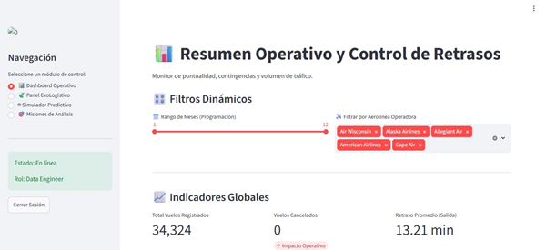
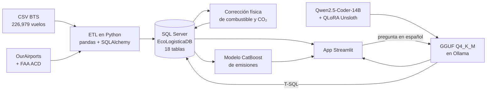
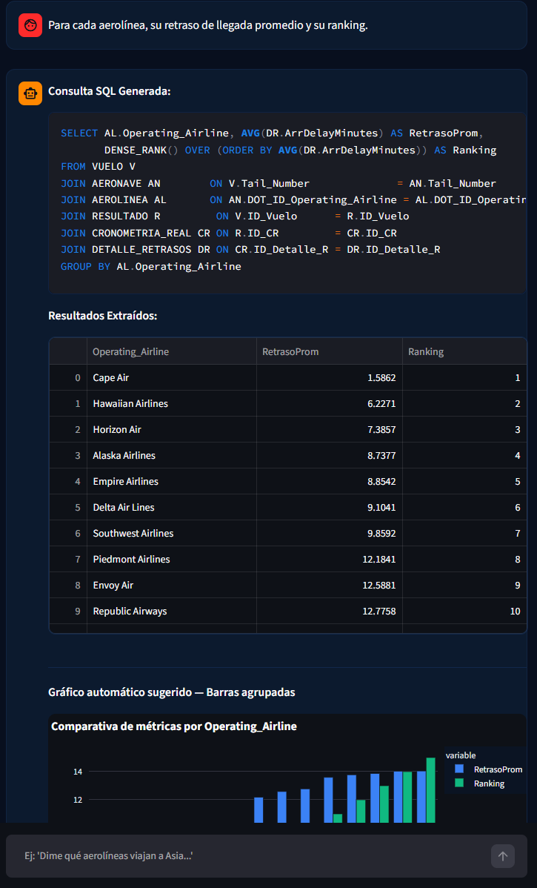
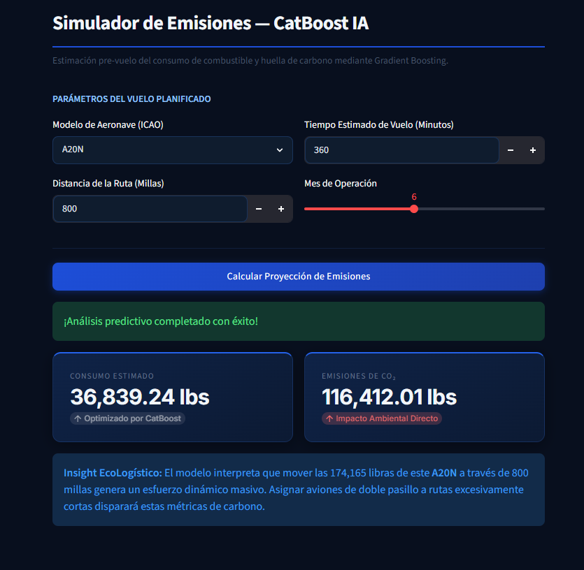
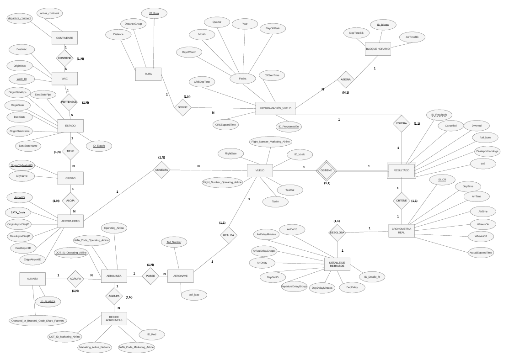

# EcoLogística Aérea — De los datos al despegue

Sistema de ingeniería de datos para analizar la **puntualidad** y la **huella de carbono** de vuelos comerciales en EE. UU. Integra un pipeline ETL hacia SQL Server, un modelo predictivo de emisiones y un **asistente text-to-SQL con un LLM afinado que corre 100 % en local**, todo servido en un dashboard de Streamlit.

> Proyecto del curso **Ingeniería de Datos** — Universidad del Pacífico (Lima, Perú), ciclo 2026-1.



---

## Qué incluye

| Componente | Descripción |
|---|---|
| **ETL → SQL Server** | Limpieza, deduplicación y carga de **226,979 vuelos** (BTS, 2018–2020) en `EcoLogisticaDB`: **225,346 vuelos** en un modelo relacional de **18 tablas** normalizado a 3FN (con desnormalización intencional para consultas analíticas). |
| **Consultas analíticas** | **26 consultas SQL avanzadas** en 5 "misiones": funciones de ventana (`LAG`, `SUM() OVER`, rankings), CTEs, acumulados YTD/MTD y un simulador parametrizado con `DECLARE`. |
| **Modelo de emisiones** | La columna `fuel_burn` original no tenía relación física con el vuelo, así que se reconstruyó con un estimador basado en la metodología **ICAO (ciclo LTO + crucero)**. Luego se compararon XGBoost, LightGBM y CatBoost: **CatBoost, R² = 0.98**. |
| **Asistente text-to-SQL ("Ecobot")** | Fine-tuning **QLoRA de Qwen2.5-Coder-14B-Instruct** con Unsloth para traducir preguntas en español a T-SQL sobre el esquema real. Exportado a GGUF (Q4_K_M) y servido con **Ollama**, sin depender de APIs externas. |
| **App Streamlit** | 5 módulos: Dashboard Operativo, Panel EcoLogístico, Simulador Predictivo, Misiones de Análisis y Ecobot. |

## Arquitectura



## Resultados

**Modelo de emisiones** (objetivo: combustible por vuelo en libras; ~183,500 vuelos; validación cruzada K = 4):

| Modelo | R² (test) | R² (CV) | MAE (lbs) | RMSE (lbs) |
|---|---|---|---|---|
| **CatBoost** (elegido) | **0.980** | **0.966** | 1,235 | **2,329** |
| LightGBM | 0.980 | 0.964 | 1,240 | 2,381 |
| XGBoost | 0.979 | 0.964 | **1,234** | 2,402 |

Fuente: [`emisiones/reporte_modelo_emisiones.json`](emisiones/reporte_modelo_emisiones.json).

**Asistente text-to-SQL:** el modelo afinado resolvió **20/20 consultas** de la batería de casos difíciles (cadenas de JOIN largas y columnas "trampa"), ejecutadas contra la base real. El modelo base fallaba justamente en esos casos. La batería está en [`asistente_sql/preguntas_test_asistente.md`](asistente_sql/preguntas_test_asistente.md) y la evaluación en `06_eval.py` (estructural) y `07_eval_sqlserver.py` (ejecución real con `ROLLBACK`).

<table>
  <tr>
    <td></td>
    <td></td>
  </tr>
  <tr>
    <td align="center"><sub>Ecobot: pregunta en español → T-SQL → resultado</sub></td>
    <td align="center"><sub>Simulador predictivo de emisiones (CatBoost)</sub></td>
  </tr>
</table>

## Estructura del repositorio

```
├── app/                      # App Streamlit (lo que corre en vivo)
│   ├── app.py                # 5 módulos; las 26 consultas están en "Misiones de Análisis"
│   ├── db_connect.py         # conexión a SQL Server
│   ├── features_emisiones.py # feature engineering (lo necesita el .pkl al cargarse)
│   └── modelo_emisiones.pkl  # modelo CatBoost entrenado
├── etl/
│   ├── etl_ecologistica.py   # limpieza + DDL de las 18 tablas + carga
│   ├── corregir_bi_emisiones.py  # recalcula fuel/CO₂ (ICAO) y corrige FKs, con respaldo previo
│   ├── revertir_bi_emisiones.py  # rollback de la corrección
│   └── diagnostico_*.py, verificacion_cifras.sql
├── emisiones/
│   ├── entrenar_fisico_FINAL.py  # entrenamiento final (XGBoost vs LightGBM vs CatBoost)
│   └── reporte_modelo_emisiones.json
├── asistente_sql/            # fine-tuning text-to-SQL (versión final)
│   ├── dataset_gen_v2_final.py   # genera pares pregunta → SQL balanceados por familia
│   ├── validar_contra_ddl.py     # valida cada SQL contra el DDL real
│   ├── 03_train_v2.py            # QLoRA (r = 64, 3 épocas) con Unsloth
│   ├── 04_export_gguf.py, 05_deploy_ollama.sh
│   ├── 06_eval.py, 07_eval_sqlserver.py, 08_validar_db_viva.py
│   ├── reentrenar_v2.sh          # pipeline completo de reentrenamiento (WSL2)
│   ├── datos/                    # train_v2.jsonl (616) / val_v2.jsonl (64)
│   ├── ollama/Modelfile
│   └── iteraciones_previas/      # v0 y v1 con Qwen, y el primer intento con Llama 3 8B
├── data/raw/                 # datos fuente (comprimidos)
├── docs/img/                 # capturas y diagramas
└── scripts/verificar_entorno.py
```

## Cómo ejecutarlo

**Requisitos:** Windows con SQL Server y *ODBC Driver 17 for SQL Server*, Python 3.11+ y [Ollama](https://ollama.com). Para reentrenar el asistente, además WSL2 y una GPU NVIDIA.

```powershell
git clone https://github.com/themasterdrop/ecologistica-aerea.git
cd ecologistica-aerea
python -m venv .venv; .venv\Scripts\activate
pip install -r requirements.txt
```

1. **Base de datos.** Crea una base vacía `EcoLogisticaDB` en SQL Server y ejecuta:
   ```powershell
   python etl/etl_ecologistica.py        # crea las 18 tablas y carga los datos
   python etl/corregir_bi_emisiones.py   # reconstrucción física de combustible y CO₂
   ```
2. **Asistente IA.** Los pesos del modelo final (GGUF Q4_K_M de 8.7 GB) no están en el repositorio. Con el archivo `qwen-ecologistica-14b.Q4_K_M.gguf` copiado en `asistente_sql/ollama/`, regístralo en Ollama:
   ```powershell
   ollama create qwen-ecologistica:14b -f asistente_sql/ollama/Modelfile
   ```
   También puedes regenerarlo desde cero con `asistente_sql/reentrenar_v2.sh` (ver más abajo).
3. **App.**
   ```powershell
   python scripts/verificar_entorno.py   # opcional: revisa dependencias y el .pkl
   streamlit run app/app.py
   ```
   Usuario de demo: `admin` / `minad123` (se puede cambiar con variables de entorno).

**Variables de entorno opcionales**

| Variable | Por defecto | Uso |
|---|---|---|
| `ECO_SQL_SERVER` | `localhost` | Servidor de SQL Server |
| `ECO_OLLAMA_MODEL` | `qwen-ecologistica:14b` | Nombre del modelo en Ollama |
| `ECO_APP_USER` / `ECO_APP_PASSWORD` | `admin` / `minad123` | Login de la app |
| `ECO_CONN` | — | Cadena ODBC para `07_eval_sqlserver.py` |

### Reentrenar el asistente

Desde WSL2, con el entorno de Unsloth (ver `asistente_sql/01_setup_wsl2.sh`):

```bash
bash asistente_sql/reentrenar_v2.sh
```

El modelo final se entrenó en una RTX 5080 (Blackwell, `sm_120`), que requiere PyTorch nightly con CUDA 12.8. El script regenera el dataset, lo valida contra el DDL, entrena el QLoRA, exporta a GGUF, registra el modelo en Ollama y prueba las consultas que antes fallaban.

## Datos

| Archivo | Fuente |
|---|---|
| `dataset_vuelos.csv.gz` | Vuelos domésticos de EE. UU., 2018–2020 (Bureau of Transportation Statistics, *On-Time Performance*) |
| `airports.csv.gz` | [OurAirports](https://ourairports.com/data/) |
| `aircraft_data.xlsx` | FAA *Aircraft Characteristics Database* (hoja `ACD_Data`) |

Los pesos del modelo (GGUF de 8.7 GB) y el adaptador LoRA no están en el repositorio por su tamaño; se pueden regenerar con los scripts de `asistente_sql/`.

## Equipo y mi aporte

Proyecto grupal del curso Ingeniería de Datos (docente: Junior John Fabian Arteaga).

**Mi aporte (Raúl Porras Hurtado):**
- Diseño del modelo entidad-relación de `EcoLogisticaDB` y su normalización (1FN → 3FN, con desnormalización intencional para las consultas analíticas).
- Fine-tuning del asistente text-to-SQL: generación y validación del dataset contra el DDL, entrenamiento QLoRA con Unsloth, exportación a GGUF y despliegue en Ollama.
- Desarrollo y despliegue de la app en Streamlit. Para la presentación final la serví desde mi propia PC, de modo que el docente pudiera usar la web y hacer consultas al asistente en vivo.



**Integrantes:**

- Mateo Pereyra Jara
- Meel Alvarado Salinas
- Nathalia Villalobos Alvarado
- Alyssa Trujillo Cruzado
- Raúl Porras Hurtado
